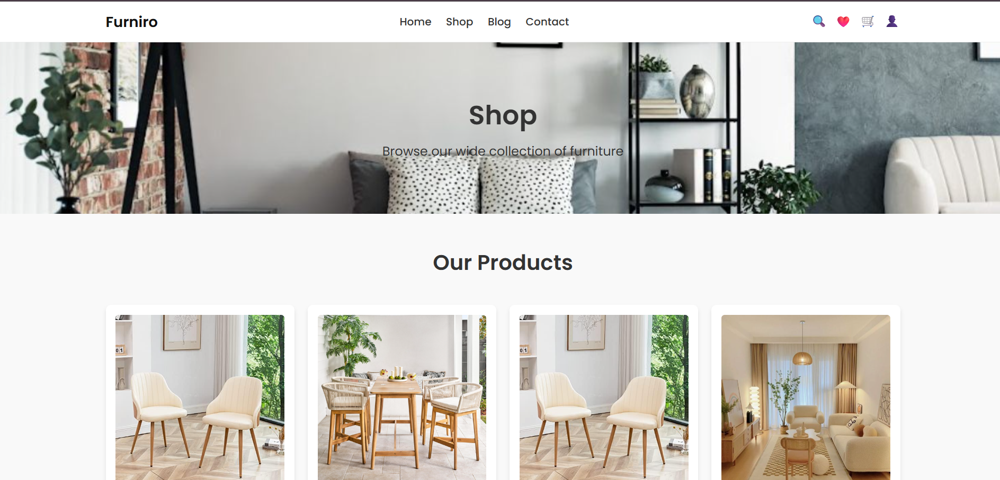
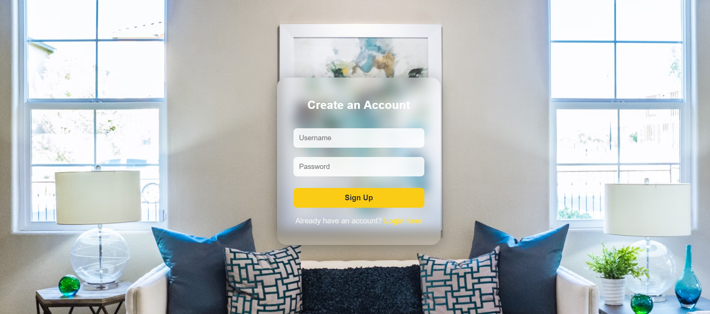

# FurniRo – E-commerce Marketplace

 

FurniRo is a modern **furniture e-commerce platform** built with **ReactJS**.  
It features a **product catalog, product details, shopping cart, login/signup system**, and a **responsive UI** with a sleek, centered login page.

This project is designed as a **learning project** for anyone who wants to explore **React development, component structure, routing, and localStorage-based authentication**.

---

## 🌟 Features


- **Home Page** – Welcome users with a beautiful banner and featured products.  
- **Shop Page** – Browse a wide collection of furniture items.  
- **Product Details Page** – View detailed information for each product.  
- **Cart Functionality** – Add products to cart with quantity management.  
- **Login & Signup** – Users can create accounts and log in using **localStorage**.  
- **Responsive Design** – Works on all screen sizes, mobile-friendly.  
- **Blog & Contact Pages** – Static pages for additional information.  
- **Smooth Navigation** – React Router DOM handles routing between pages.

---

## 🛠️ Tech Stack

- **Frontend:** ReactJS, React Router DOM  
- **Styling:** CSS (with modern glassy design for login/signup)  
- **State Management:** React Context API (for cart functionality)  
- **Storage:** LocalStorage for login/signup persistence  
- **Bundler:** Vite

---

## 🎓 Learning Objectives

This project is great for beginners who want to learn:

1. **React Components** – Functional components, props, and modular design.  
2. **React Router** – Client-side routing and nested routes.  
3. **State Management** – Using `useState` and Context API for cart state.  
4. **LocalStorage** – Persistent login/signup functionality.  
5. **Responsive Design** – Flexbox, centered login, and adaptive layouts.  
6. **Project Structure** – Organizing pages, components, and assets efficiently.

---
## 💡 Usage Tips

- **New users:** Sign up on login page  
- **Existing users:** Login with saved credentials  
- **Cart:** Add products and manage quantity  
- **Persistent login:** LocalStorage keeps info on refresh  

## ⚡ Future Enhancements

- Add **checkout page & payment**  
- Connect to **real backend for authentication**  
- Implement **search & filter functionality**  
- Add **wishlist & favorites**  
- Deploy online via **Netlify / Vercel**  

## 👏 Contribution

1. Fork the repository  
2. Create a new branch:  
   ```bash
   git checkout -b feature-name


## 🚀 Getting Started

### Prerequisites

- Node.js & npm installed on your machine
- Basic understanding of ReactJS

### Installation

```bash
git clone https://github.com/your-username/furniro-ecommerce.git
cd furniro-ecommerce
npm install
npm run dev


